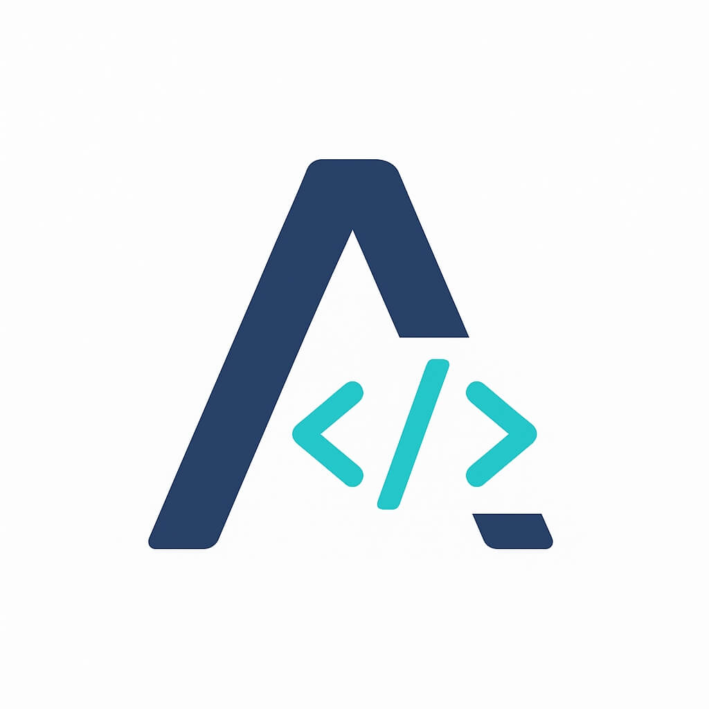

# 🌟 Abdullah Salam - Portfolio Website

A modern, professional portfolio website showcasing Flutter and Web Development projects with bilingual support (Arabic/English) and dark/light themes.



## ✨ Features

### 🎨 Design
- **Glassmorphism UI** - Modern glass morphism effects
- **Dark/Light Mode** - Seamless theme switching
- **Responsive Design** - Works perfectly on all devices
- **Smooth Animations** - Parallax effects, fade-ins, and transitions

### 🌐 Internationalization
- **Bilingual Support** - Full Arabic and English translations
- **RTL/LTR Layout** - Automatic direction switching
- **Auto-Detection** - Browser language detection on first visit

### 🚀 Performance
- **Lazy Loading** - Images load on demand
- **Optimized Assets** - Compressed images and code
- **Fast Loading** - Optimized for performance

### 💼 Features
- **Dynamic Projects** - Firebase-powered project showcase
- **Admin Panel** - Easy project management
- **Contact Form** - EmailJS integration
- **CV Download** - Multiple language options
- **Social Links** - Connected to all platforms

## 🛠️ Technologies Used

### Frontend
- HTML5
- CSS3 (with CSS Variables)
- JavaScript (ES6+)
- Font Awesome Icons
- Google Fonts (Outfit, Tajawal)

### Backend & Services
- Firebase Firestore (Project storage)
- Firebase Storage (Image hosting)
- Firebase Authentication (Admin access)
- EmailJS (Contact form)
- Google Analytics

## 📦 Project Structure

```
Portfolio Website/
├── index.html              # Main page
├── admin.html             # Admin panel
├── admin-login.html       # Admin login
├── 404.html               # Error page
├── css/
│   ├── variables.css      # CSS variables (colors, spacing)
│   ├── style.css          # Main styles
│   ├── animations.css     # Animation styles
│   ├── toast.css          # Toast notifications
│   └── skeleton.css       # Loading skeletons
├── js/
│   ├── main.v2.js         # Main app logic
│   ├── lang.js            # Translations
│   ├── firebase-config.js # Firebase setup
│   ├── admin.js           # Admin panel logic
│   └── toast.js           # Toast system
├── assets/
│   ├── cv.pdf            # Arabic CV
│   └── cv-en.pdf         # English CV
└── README.md             # This file
```

## 🚀 Getting Started

### Prerequisites
- Modern web browser (Chrome, Firefox, Edge, Safari)
- Text editor (VS Code recommended)
- Firebase account (for backend features)

### Installation

1. **Clone the repository**
```bash
git clone <your-repo-url>
cd Portfolio-Website
```

2. **Set up Firebase**
   - Create a Firebase project at [Firebase Console](https://console.firebase.google.com/)
   - Enable Firestore Database
   - Enable Firebase Storage
   - Enable Authentication (Email/Password)
   - Copy your Firebase config

3. **Configure Firebase**
   - Open `js/firebase-config.js`
   - Replace the config with your Firebase credentials

4. **Set up EmailJS**
   - Create account at [EmailJS](https://www.emailjs.com/)
   - Create email service
   - Create email template
   - Update service IDs in `js/main.v2.js`

5. **Run locally**
   - Simply open `index.html` in your browser
   - Or use a local server:
   ```bash
   # Using Python
   python -m http.server 8000
   
   # Using Node.js
   npx http-server
   ```

6. **Access admin panel**
   - Go to `admin-login.html`
   - Use your Firebase authentication credentials

## 🌐 Deployment

### Netlify (Recommended)

1. Push code to GitHub
2. Go to [Netlify](https://www.netlify.com/)
3. Click "New site from Git"
4. Connect your repository
5. Deploy!

### Vercel

1. Install Vercel CLI
```bash
npm i -g vercel
```

2. Deploy
```bash
vercel
```

### GitHub Pages

1. Go to repository Settings
2. Enable GitHub Pages
3. Select branch and folder
4. Site will be live at `username.github.io/repo-name`

## 🔧 Configuration

### Change Colors
Edit `css/variables.css`:
```css
--accent-primary: #your-color;
--accent-secondary: #your-color;
```

### Add Translations
Edit `js/lang.js`:
```javascript
const translations = {
  en: { key: "English text" },
  ar: { key: "Arabic text" }
};
```

### Update Projects
Use the Admin Panel at `admin.html` or directly edit Firestore.

## 📱 Browser Support

- ✅ Chrome (recommended)
- ✅ Firefox
- ✅ Safari
- ✅ Edge
- ✅ Opera

## 🤝 Contributing

This is a personal portfolio, but suggestions are welcome!

1. Fork the project
2. Create your feature branch (`git checkout -b feature/AmazingFeature`)
3. Commit your changes (`git commit -m 'Add some AmazingFeature'`)
4. Push to the branch (`git push origin feature/AmazingFeature`)
5. Open a Pull Request

## 📄 License

This project is licensed under the MIT License - see the [LICENSE](LICENSE) file for details.

## 👤 Author

**Abdullah Salam**

- 📧 Email: bnbmwmrnrnmb@gmail.com
- 📱 Phone: 07728306149 / 07864427149
- 💼 GitHub: [@abdullahsalam](https://github.com/abdullahsalam)
- 🔗 LinkedIn: [Abdullah Salam](https://linkedin.com/in/abdullahsalam)

## 🙏 Acknowledgments

- Font Awesome for icons
- Google Fonts for typography
- Firebase for backend services
- EmailJS for email integration
- All open-source libraries used

## 📝 Changelog

### Version 2.0 (Current)
- ✨ Added bilingual support (AR/EN)
- 🎨 Implemented dark/light themes
- 🔥 Integrated Firebase backend
- 📧 Added EmailJS contact form
- 🎯 Admin panel for project management
- 📱 Full responsive design
- ⚡ Performance optimizations

### Version 1.0
- 🎉 Initial release
- 📄 Basic portfolio structure
- 🎨 Static design

---

**Made with ❤️ using HTML, CSS & JavaScript**

🌟 If you like this project, give it a star!
